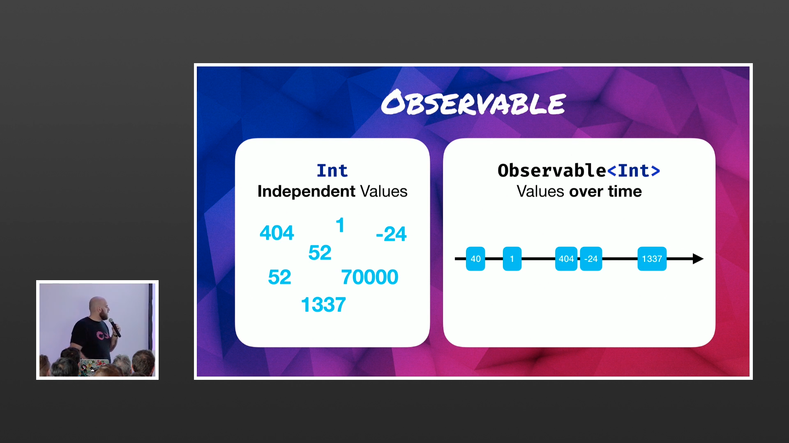
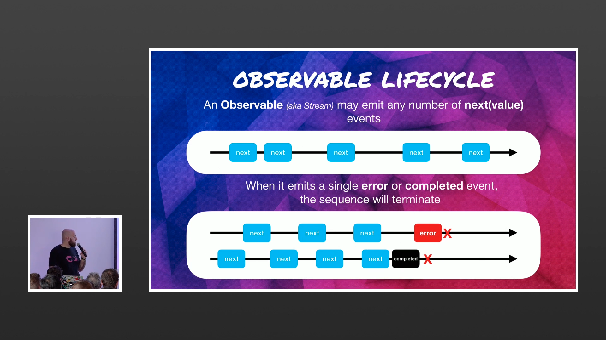
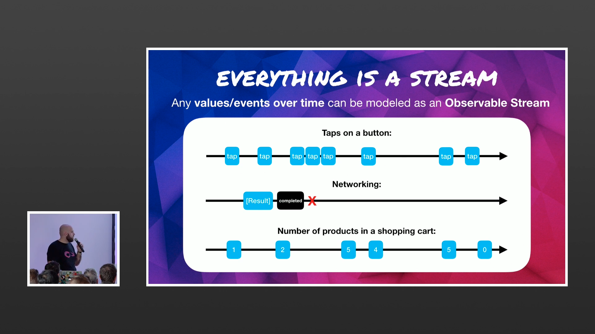
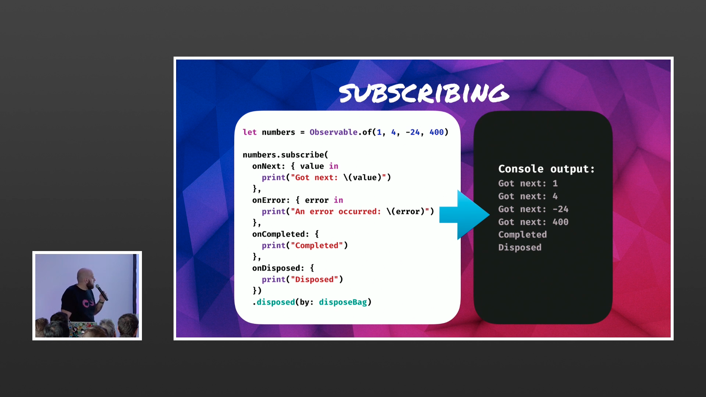
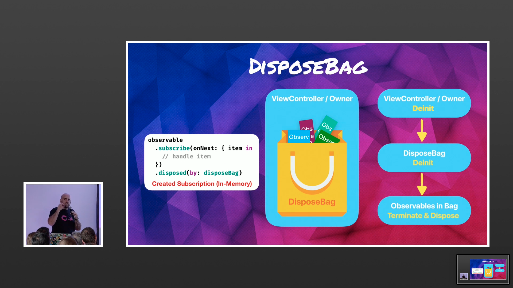
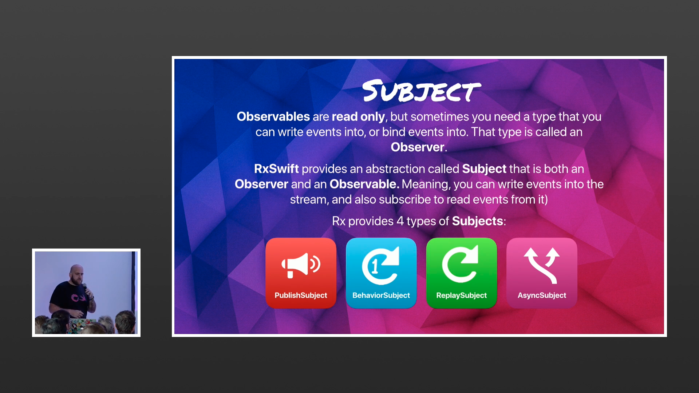
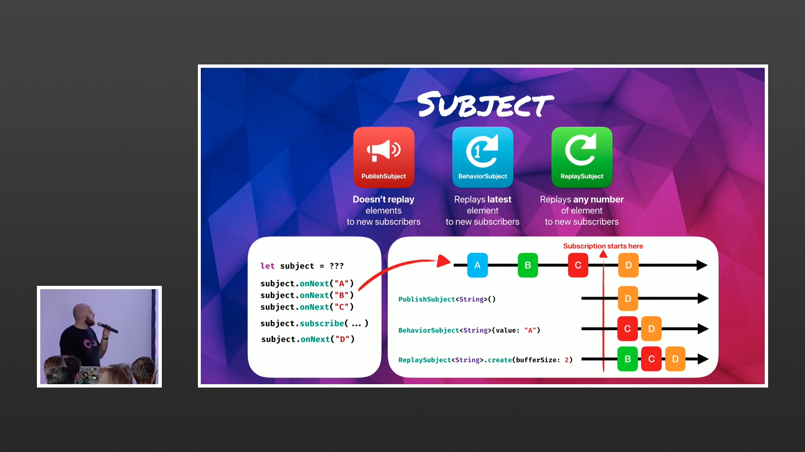
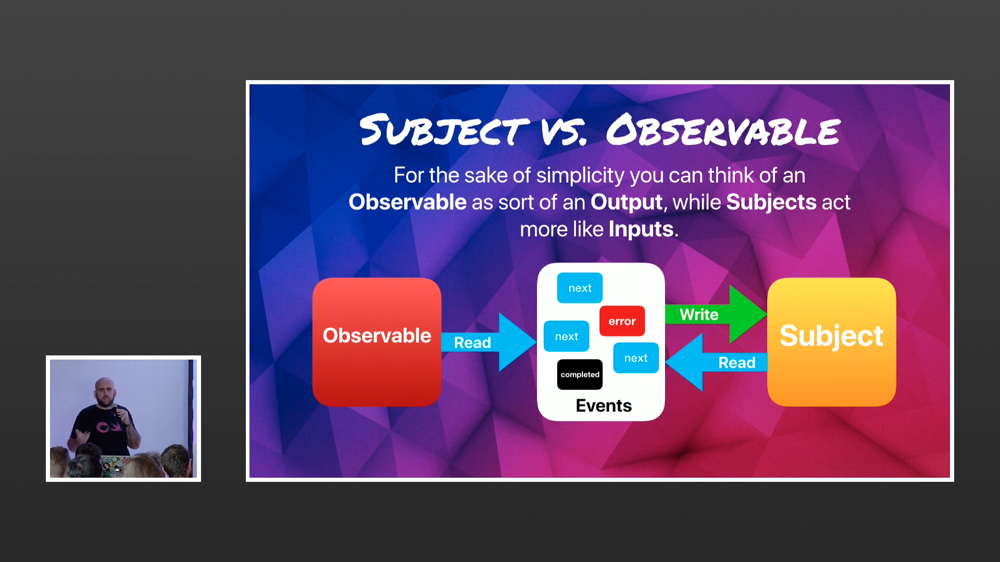

# RXBible

RxSwift is a library that gives us an easy use of the Observer Pattern

Observables simply put is a list of values we can itterate over, List of things you are watching 
Observers are the things watching (you can call it a subscriber too.)


# Observable Categories

 1. Unbounded list of events taps, clicks..
 2. Single Variable that notifies of changes over time
 3. Task of Code that notifies when it finishes
 4. Bounded Array of Elements


```Swift
        let array = Observable.from([1,2,3,4,5,6])
        
        let subscription = array.subscribe { number in
            print(number)
        } onError: { erro in
            print(erro)
        } onCompleted: {
            print("complete")
        } onDisposed: {
            print("disposed")
        }
 ```
 Array is the Observerable subscription is the observer

 An Observable are values linked on a timeline - a Stream of variables.
 

# Observable LifeCycle - Everything is a stream of singular Values
 

 Remember 👨🏽‍🏫 everything is a stream.
 

You listen to a stream of values by subscribing to it, simple as that.


We use disposal to manage memory, the VC owns the bags which means it owns all the subscriptions it needs.


# Let's talk about this Subject :p
Subject = Observable + Observer
There are 4 types of subjects, the last on is not used a lot

This is their behavior:

Observer vs Subject


